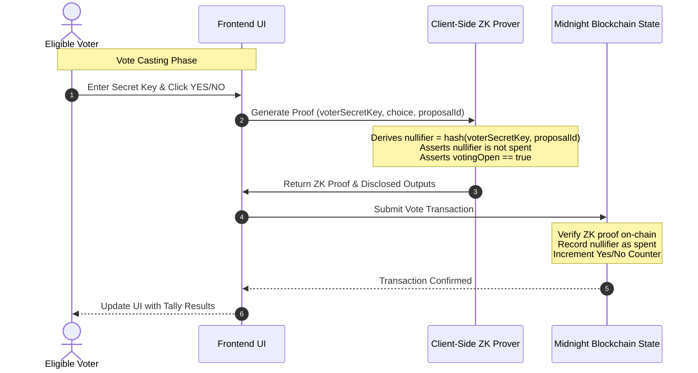

# Private Voting dApp on Midnight Blockchain

[](https://github.com/Aryan132005/Level3-New-Moon/actions/workflows/ci.yml)

A production-grade, privacy-preserving decentralized application (dApp) built on the Midnight blockchain. This dApp allows eligible voters to cast anonymous YES/NO ballots on proposals, where votes are verifiably tabulated but cannot be linked to the voters' on-chain identities.

## Table of Contents
1. [Privacy Model](#privacy-model)
2. [System Architecture](#system-architecture)
3. [Core Technologies](#core-technologies)
4. [Prerequisites & Environment Setup](#prerequisites--environment-setup)
5. [Compilation Guide](#compilation-guide)
6. [Testing Guide](#testing-guide)
7. [Running the Application](#running-the-application)
8. [CI/CD Pipeline](#cicd-pipeline)
9. [License](#license)

---

## Privacy Model

This dApp implements a strict cryptographic privacy model using Zero-Knowledge Proofs (ZKP) to ensure voter anonymity while maintaining ledger integrity.

### Cryptographic Assurances
*   **Voter Anonymity:** When casting a vote, the voter generates a ZK proof client-side using their private secret key (`voterSecretKey`). The smart contract never sees or stores this secret key.
*   **Unlinkability:** The vote choice (YES or NO) is disclosed to the public ledger counters (`yesTally` and `noTally`) to allow live tabulations, but the transaction casting the vote cannot be linked to the voter's identity.
*   **Double-Voting Prevention (Nullifiers):** To prevent a voter from voting multiple times, a unique nullifier is derived deterministically from the voter's private secret and the proposal ID:
    $$\text{nullifier} = \text{persistentHash}(\text{voterSecretKey}, \text{proposalId})$$
    This nullifier is recorded on-chain in `nullifierSet`. The ZK circuit verifies that the nullifier does not already exist in the set before permitting the transaction. Because the hash is one-way, an observer cannot derive the voter's identity from the nullifier.
*   **Voting Period Enforcement:** A public ledger boolean `votingOpen` tracks if the poll is active. The circuit asserts `votingOpen == true` before allowing a vote to proceed.
*   **Admin Closure:** The proposal creator commits an admin public key hash (`adminCommitment`) during deployment. To close the voting period, the admin must provide the matching secret key (`adminSecretKey`) to prove their authority inside a ZK proof.

### Information Exposure Matrix

| Actor | What They Learn | What They Cannot Learn |
| :--- | :--- | :--- |
| **Passive Observer / Node** | • Proposal text & ID<br>• Public counters (`yesTally`, `noTally`) <br>• Spent nullifiers list<br>• Voting state (`votingOpen`) | • Voter's identity / wallet address<br>• Which voter voted for which choice<br>• The admin's private secret key |
| **Eligible Voter** | • Their own choice & key<br>• Current public tallies | • Other voters' choices or secrets |
| **Contract Admin** | • Admin secret key<br>• Current public tallies | • Voter identities or their individual choices |

---

## System Architecture

The following diagram illustrates the transaction workflow for casting an anonymous ballot:



---

## Core Technologies

1.  **Midnight L1 Ledger:** A privacy-first L1 ledger utilizing zero-knowledge proofs.
2.  **Compact:** The domain-specific smart contract language developed by Midnight to define zk circuits and public state transitions.
3.  **Midnight.js SDK:** TypeScript SDK used to deploy contracts, query states, and submit transaction proofs.
4.  **Vite + React + TypeScript:** High-performance, premium frontend dashboard.
5.  **Vitest:** Ultra-fast TypeScript unit testing framework running simulation tests.

---

## Prerequisites & Environment Setup

*   **Node.js:** v20.x or v22.x installed.
*   **WSL (Windows Subsystem for Linux):** Required since the Compact compiler is native to Ubuntu/Linux.
*   **Docker:** Installed and running on host system (required for test environment integration tests).

---

## Compilation Guide

Since the Compact compiler distributes Linux-native binaries, compilation must run inside WSL.

1.  Open WSL (Ubuntu) and install the compiler:
    ```bash
    curl -sSfL https://github.com/midnightntwrk/compact/releases/download/compact-v0.5.1/compact-installer.sh | sh
    ```
2.  Add the compiler to path:
    ```bash
    export PATH="$HOME/.local/bin:$PATH"
    ```
3.  Navigate to the project root directory inside WSL (e.g., `/mnt/c/Users/user/OneDrive/Desktop/Level3 New Moon`) and compile:
    ```bash
    compact compile contracts/voting.compact contracts/managed/voting
    ```
    This generates the TypeScript bindings, ZK circuits, verifiers, and proving keys in `contracts/managed/voting`.

---

## Testing Guide

Our test suite uses in-memory simulation to run full contract circuit transitions client-side without launching Docker containers or devnets.

1.  Install dependencies:
    ```bash
    npm install
    ```
2.  Run the Vitest test suite:
    ```bash
    npm run test
    ```
    *This runs three comprehensive tests verifying happy-path voting, double-voting rejection, and voting-closed rejection.*

### Automated Test Output Verification
Below is a screenshot of the 3 passing unit tests executing successfully in the Vitest environment:


---

## Running the Application

To run the frontend locally:

1.  Start the Vite dev server:
    ```bash
    npm run dev
    ```
2.  Open your browser and navigate to `http://localhost:5173`.
3.  **Sandbox Mode:** If the Lace wallet is not connected, the dApp automatically boots into Sandbox ZK Simulator mode, allowing you to deploy proposals, generate voter secrets, cast anonymous votes, and close voting with full local cryptographic verification.
4.  **Lace Wallet Mode:** Connect your Lace browser extension to deploy and transact on the live Midnight testnet.

---

## Visual Demonstration

### Application UI Dashboard
Here is the custom dark glassmorphic user interface showing live proposals and ZK tally statistics:


### 1-Minute Walkthrough Video
The video demonstration below shows the full functionality in action: proposal creation, random voter key generation, anonymous voting transitions, proof generation loading states, and administrative closure.


---

## CI/CD Pipeline

A GitHub Actions workflow is located at `.github/workflows/ci.yml`. On every push and pull request to `master` and `main`, the workflow:
1. Installs the Compact compiler.
2. Compiles `contracts/voting.compact`.
3. Executes the Vitest unit tests.
4. Runs the production build command (`npm run build`) to ensure bundle validity.

---

## Troubleshooting & FAQs

### WSL Paths and Compilation Mismatch
If you get `Exception: voting.compact line 1: language version 0.23.0 mismatch` when running `compact compile`, make sure your contract has:
```typescript
pragma language_version 0.23;
```
which matches the syntax expected by the `compact` compiler (v0.31.x / v0.23.0 engine).

### Web Crypto digest error in Browser
If you get type errors regarding `ArrayBuffer` in Web Crypto APIs:
```typescript
const hashBuffer = await window.crypto.subtle.digest('SHA-256', data as any);
```
Ensure you have cast the `Uint8Array` to `any` or used `data.buffer` to pass the correct `ArrayBufferView` format.

---

## License

This project is licensed under the MIT License. See the [LICENSE](LICENSE) file for details.
